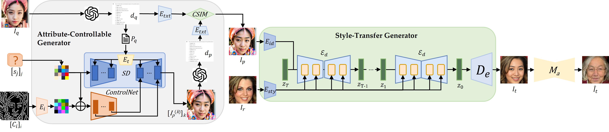
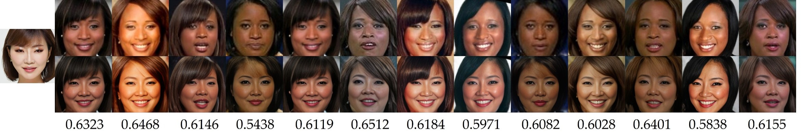
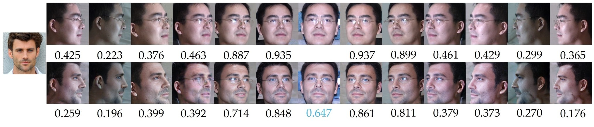
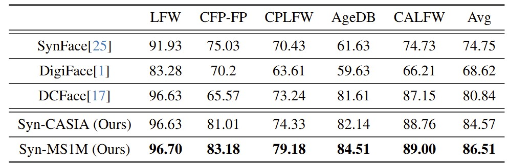

# Formulated Diffusion with Transferred Attributes for Face Synthesis and Recognition

> **Abstract:** We propose the Formulated Diffusion with Transferred Attributes (FDTA) framework to synthesize faces of user-specified attributes and apply the synthesized faces to train face recognition models. Our work addresses several important issues associated with models trained on real faces, including attribute imbalance, privacy concerns, and the complexities of data annotation. The proposed FDTA framework comprises two synergistic modules: the Attribute Controllable Generator (ACG) and the Style Transfer Generator (STG). The ACG aims to create unique face images with user-specified attributes including gender, race, age, facial shape, and others. It integrates ChatGPT in the design of formulated prompts that drive a Stable Diffusion model coupled with ControlNet to generate unique face images with desired attributes. The formulated prompts are designed based on learning from interactions with ChatGPT. Given an ACG-generated face and a reference face, the STG generates a target face of the same identity as the ACG-generated face but in the style of the reference face. Our approach enables users to specify attributes and diversify styles when making synthetic data for different applications. To evaluate the effectiveness of our approach, we generated four synthetic datasets, namely Syn-MPIE, Syn-MS1M, Syn-VGGFace2 and Syn-CASIA, and compared them with their real-life counterparts. We also benchmark our approach against other state-of-the-art methods that use synthetic data for face recognition.
>
> 
## Syn-MS1M 
The MS1Mv3 dataset, with 93,432 subjects and 5,179,510 images, presents challenges due to subject variability. Using ACG, we assigned each synthetic identity a unique MS1Mv3 subject for STG style augmentation, generating the Syn-MS1M-10K, Syn-MS1M-20K, Syn-MS1M-50K, and Syn-MS1M-100K datasets.



### Syn-MS1M (10K ids/1M images)
Below is the Google Drive download link for Syn-MS1M, where each subject has undergone age and pose augmentation, including 10k subjects and 1M images.
- [Google Drive](https://drive.google.com/drive/folders/1TN_FftxXr_IP0iqsnu11itPGpCyfpYTo?usp=sharing)

## Syn-MPIE 
The Multi-PIE database features four sessions with 337 subjects, capturing diverse facial poses, lighting conditions, and expressions. Selected parameters include 13 yaw angles (-90° to +90° in 15° steps), seven lighting conditions (-60° to +60° in 30° intervals, plus overhead and ambient lighting), and two expressions (neutral and smiling). Each identity generated 182 synthetic data points, forming the Syn-MPIE-2000 dataset.



### Syn-MPIE (2K ids/0.36M images)
Below is the Google Drive download link for Syn-MPIE, which includes 10k subjects and 0.36M images.
- [Google Drive](https://drive.google.com/drive/folders/1NQgHm_CM7zgnXtq_Vs5K6Y3s3zmEu8ZT?usp=sharing)

## train.rec file to JPG files 
If you want to convert a train.rec file to JPG files, you can use rec2image.py to extract the images.

```
python rec2image.py --rec_path YOUR train.rec FILE PATH --output_dir YOUR DESIRED OUTPUT LOCATION
```

## Comparison with SOTA Models 

Verification accuracy on benchmarks of Our FR model with SOTA method. Our approach shows superior handling of cross-pose challenges, 
notably in the CFP-FP[29] benchmark, while DCFace is particularly adept with the age variations in AgeDB. 
The data reflects Syn-MS1M’s consistently higher accuracy, underscoring the effectiveness of our approach in diverse face recognition scenarios.
